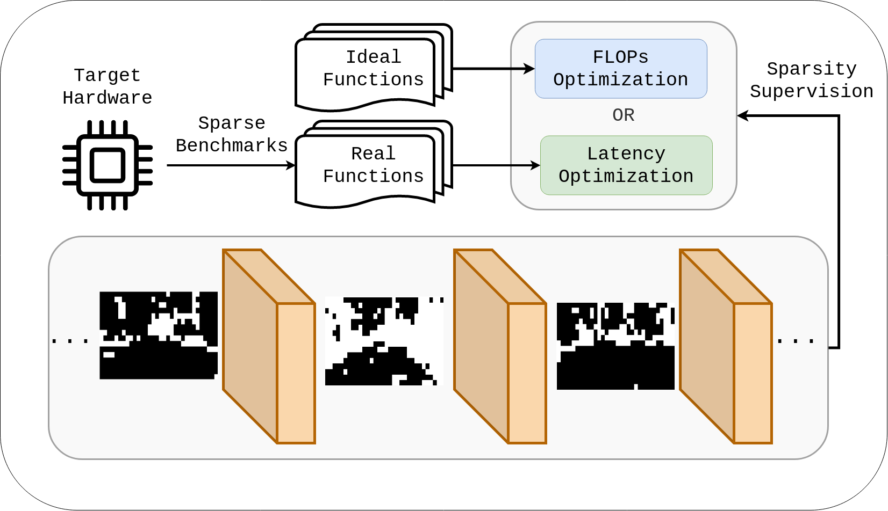

# Latency Driven Spatially Sparse Optimization for Multi-Branch CNNs for Semantic Segmentation

Code accompanying the paper:
> [Latency Driven Spatially Sparse Optimization for Multi-Branch CNNs for Semantic Segmentation]([https://arxiv.org/abs/2102.11646](https://openaccess.thecvf.com/content/WACV2024W/LLVM-AD/html/Zampokas_Latency_Driven_Spatially_Sparse_Optimization_for_Multi-Branch_CNNs_for_Semantic_WACVW_2024_paper.html))\
> Georgios Zampokas, Christos-Savvas Bouganis, Dimitrios Tzovaras.

    

Code coming soon.
